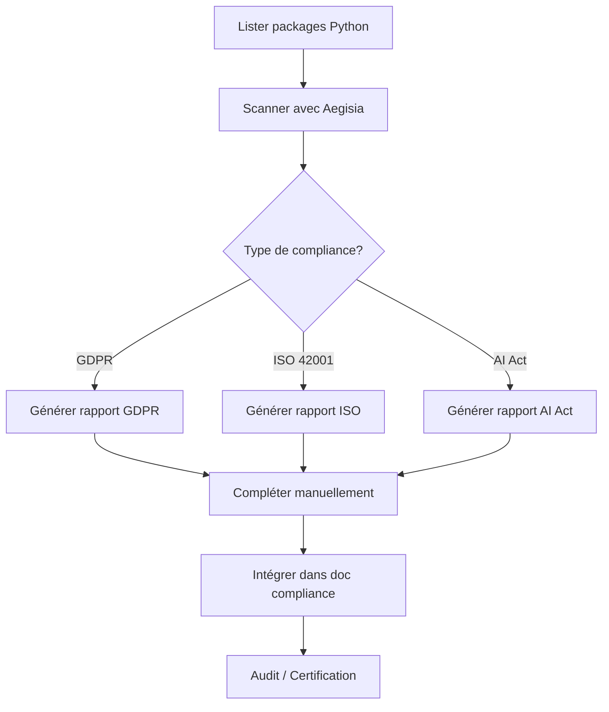

# 📋 Guide Utilisateur - Vérification de Compliance avec Aegisia

## 🎯 Cas d'Usage : Je dois générer un rapport de conformité

### Scénario 1 : RGPD (GDPR)

**Contexte** : Vous développez une application Python qui traite des données personnelles et vous devez documenter votre conformité RGPD pour un audit.

#### Étape 1 : Analyser vos dépendances

```bash
# Lancez Aegisia
cd python-dependency-analyzer
npm run dev
```

#### Étape 2 : Scanner votre projet

1. **Ouvrez** `http://localhost:5173`
2. **Collez** la liste de vos packages Python :
   ```
   django
   psycopg2
   celery
   redis
   requests
   boto3
   ```
3. **Cliquez** sur "Analyser plusieurs packages"

#### Étape 3 : Obtenir le rapport GDPR

**Option A : Via l'interface (Future)**
```
[Export] → [Compliance] → [GDPR Report] → Télécharger
```

**Option B : Via la console développeur (Actuel)**
```javascript
// Ouvrez la console (F12) et exécutez :
import { GDPRGenerator } from './services/compliance';
const gdprGen = new GDPRGenerator();
const report = gdprGen.generateReport(dependencies);
console.log(report);
```

#### Étape 4 : Interpréter le rapport

Le rapport GDPR généré contient :

```markdown
# Rapport de Conformité GDPR

## Article 30 - Registre des Activités de Traitement

### Packages identifiés avec traitement de données

#### django v4.2.0
- **Finalité**: Framework web avec ORM
- **Type de données**: Données personnelles variées
- **Base légale**: À définir selon la politique
- **Durée de conservation**: À définir
- **Transferts internationaux**: Non

#### psycopg2 v2.9.5
- **Finalité**: Stockage et gestion des données
- **Type de données**: Données personnelles variées
- **Base légale**: Consentement / Intérêt légitime
...
```

#### Étape 5 : Compléter le rapport

Le rapport généré automatiquement est un **point de départ**. Vous devez :

1. ✅ **Vérifier** les packages identifiés
2. ✏️ **Compléter** les bases légales
3. 📅 **Ajouter** les durées de conservation
4. 🌍 **Confirmer** ou corriger les transferts internationaux
5. 📋 **Intégrer** dans votre documentation RGPD complète

---

### Scénario 2 : ISO 42001 (Systèmes de Management IA)

**Contexte** : Votre entreprise déploie des modèles ML et doit se conformer à ISO/IEC 42001:2023.

#### Étape 1 : Identifier vos packages IA

```
tensorflow
scikit-learn
transformers
openai
langchain
```

#### Étape 2 : Générer le rapport ISO 42001

```javascript
import { ISO42001Generator } from './services/compliance';
const isoGen = new ISO42001Generator();
const report = isoGen.generateReport(dependencies);
```

#### Étape 3 : Utiliser le rapport

Le rapport ISO 42001 vous aide avec :

- **Section 4** : Contexte de l'organisation
  - ✅ Liste des packages IA utilisés
  - ✅ Catégorisation (Deep Learning, NLP, Computer Vision)
  - ✅ Niveau de risque par package

- **Section 6** : Gestion des risques
  - ✅ Évaluation automatique des risques
  - ✅ Identification des packages à risque élevé
  - ✅ Recommandations d'atténuation

- **Section 9** : Évaluation des performances
  - ✅ Métriques de qualité suggérées
  - ✅ KPIs de monitoring

**Exemple de sortie :**
```markdown
## 1. Contexte de l'Organisation

### Packages IA Identifiés

#### tensorflow v2.15.0
- **Catégorie**: Deep Learning Framework
- **Risque**: 6.5/10
- **Transparence**: ⚠️ (Explainability limitée)

### Mesures d'Atténuation
- Validation sur datasets diversifiés
- Tests de robustesse
- Documentation des biais
- Monitoring en production
```

---

### Scénario 3 : EU AI Act

**Contexte** : Vous devez classifier votre système IA selon l'AI Act européen.

#### Packages Concernés

Si vous utilisez :
- `face-recognition` → 🚫 Risque inacceptable / ⚠️ Haut risque
- `transformers` / `gpt` → 📋 Transparence requise
- `scikit-learn` → ✅ Risque minimal

#### Rapport AI Act

```javascript
import { AIActGenerator } from './services/compliance';
const aiActGen = new AIActGenerator();
const report = aiActGen.generateReport(dependencies);
```

**Sortie :**
```markdown
# Rapport de Conformité EU AI Act

## Classification des Risques

### Systèmes à Risque Inacceptable 🚫
*Aucun système identifié*

### Systèmes à Haut Risque ⚠️
- **face-recognition v1.3.0**: Identification biométrique

**Obligations :**
- Système de gestion des risques
- Gouvernance et qualité des données
- Documentation technique
- Supervision humaine
- Exactitude, robustesse, cybersécurité

### Systèmes à Transparence Requise 📋
- **transformers v4.35.0**: Génération de contenu

**Obligations :**
- Informer que le contenu est généré par IA
- Conception pour éviter la génération illégale
```

---

## 🔄 Workflow Complet de Compliance



---

## 💼 Cas d'Usage Professionnels

### Cas 1 : Audit RGPD par la CNIL

**Besoin** : Préparer le Registre des Activités de Traitement (Article 30)

**Solution Aegisia** :
1. Scannez tous les microservices Python
2. Générez un rapport GDPR par service
3. Identifiez les packages qui traitent des données sensibles
4. Complétez avec les finalités métier
5. Consolidez dans le registre global

**Gain de temps** : 4-8 heures → 30 minutes

---

### Cas 2 : Certification ISO 42001

**Besoin** : Documenter les systèmes IA pour la certification

**Solution Aegisia** :
1. Inventoriez tous les packages ML/AI
2. Générez le rapport ISO 42001
3. Utilisez les sections pré-remplies comme base
4. Ajoutez la documentation spécifique métier
5. Soumettez pour audit

**Gain de temps** : 2-3 jours → 4 heures

---

### Cas 3 : Mise en conformité AI Act

**Besoin** : Classifier les systèmes IA selon l'AI Act

**Solution Aegisia** :
1. Scannez tous les projets utilisant l'IA
2. Générez le rapport AI Act
3. Identifiez les systèmes à haut risque
4. Priorisez les actions de conformité
5. Mettez en place les obligations requises

**Gain de temps** : 1 semaine → 1 jour

---

## 🎓 Tutoriel Vidéo (À venir)

1. **Introduction** (2 min) - Vue d'ensemble d'Aegisia
2. **Scanner un projet** (3 min) - Demo complète
3. **Générer un rapport GDPR** (5 min)
4. **Générer un rapport ISO 42001** (5 min)
5. **Générer un rapport AI Act** (5 min)

[📺 Playlist YouTube](https://youtube.com/@aegisia) (Coming Soon)

---

## 📞 Support Compliance

**Questions fréquentes** :

**Q: Le rapport est-il suffisant pour un audit ?**  
R: Non, c'est une **aide à la préparation**. Vous devez compléter avec :
- Les finalités métier spécifiques
- Les bases légales adaptées
- Les mesures de sécurité implémentées
- La documentation des traitements

**Q: Dois-je être expert RGPD pour utiliser Aegisia ?**  
R: Non, mais des connaissances de base sont recommandées. Aegisia **automatise** la partie technique (identification des packages traitant des données), mais l'**analyse juridique** reste nécessaire.

**Q: Puis-je utiliser Aegisia pour d'autres frameworks (Java, Node.js) ?**  
R: Actuellement, seul Python est supporté. JavaScript/npm est prévu pour Q2 2025.

---

## 📚 Ressources Complémentaires

### RGPD
- [📖 CNIL - Guide du Registre](https://www.cnil.fr/fr/RGDP-le-registre-des-activites-de-traitement)
- [📋 Template Article 30](https://gdpr.eu/article-30-controller-processor/)

### ISO 42001
- [📖 ISO/IEC 42001:2023 Overview](https://www.iso.org/standard/81230.html)
- [📋 Implementation Guide](https://www.bsigroup.com/en-GB/iso-42001/)

### AI Act
- [📖 Texte officiel AI Act](https://artificialintelligenceact.eu/)
- [📋 Classification Guide](https://digital-strategy.ec.europa.eu/en/policies/regulatory-framework-ai)

---

## 🚀 Prochaines Fonctionnalités

- [ ] **Interface UI pour compliance** - Boutons d'export directs
- [ ] **Templates personnalisables** - Adaptez les rapports à votre contexte
- [ ] **Multi-projets** - Scannez plusieurs repos en une fois
- [ ] **API REST** - Intégrez dans vos outils CI/CD
- [ ] **Alertes** - Notifications quand de nouvelles obligations apparaissent

---

**Besoin d'aide ?** Ouvrez une [discussion GitHub](https://github.com/ghjulia01/aegisia/discussions) ou consultez la [documentation complète](./docs).
